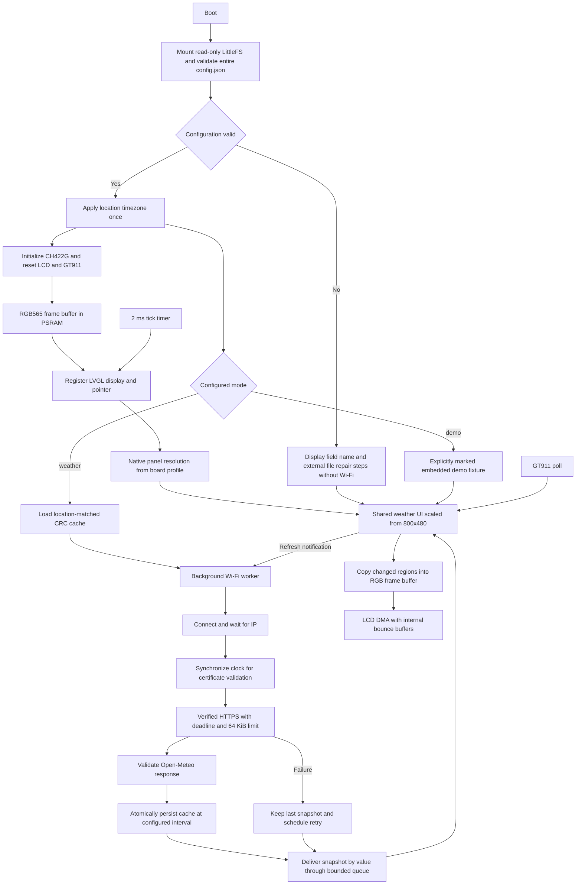

# Station runtime

```mermaid
flowchart TD
    Boot[Boot] --> Config[Mount read-only LittleFS and validate entire config.json]
    Config --> Valid{Configuration valid}
    Valid -->|No| ConfigError[Display field name and external file repair steps without Wi-Fi]
    Valid -->|Yes| Zone[Apply location timezone once]
    Zone --> Board[Initialize CH422G and reset LCD and GT911]
    Board --> RGB[RGB565 frame buffer in PSRAM]
    RGB --> LVGL[Register LVGL display and pointer]
    LVGL --> Profile[Native panel resolution from board profile]
    Profile --> Screen[Shared weather UI scaled from 800x480]
    ConfigError --> Screen
    Mode{Configured mode} -->|demo| Demo[Explicitly marked embedded demo fixture]
    Mode -->|weather| Cache[Load location-matched CRC cache]
    Zone --> Mode
    Demo --> Screen
    Cache --> Worker[Background Wi-Fi worker]
    Worker --> IP[Connect and wait for IP]
    IP --> NTP[Synchronize clock for certificate validation]
    NTP --> HTTPS[Verified HTTPS with deadline and 64 KiB limit]
    HTTPS --> Parse[Validate Open-Meteo response]
    Parse --> Save[Atomically persist cache at configured interval]
    Save --> Queue[Deliver snapshot by value through bounded queue]
    HTTPS -->|Failure| Backoff[Keep last snapshot and schedule retry]
    Backoff --> Queue
    Queue --> Screen
    Screen -->|Refresh notification| Worker
    Timer[2 ms tick timer] --> LVGL
    Touch[GT911 poll] --> Screen
    Screen --> Flush[Copy changed regions into RGB frame buffer]
    Flush --> LCD[LCD DMA with internal bounce buffers]
```
