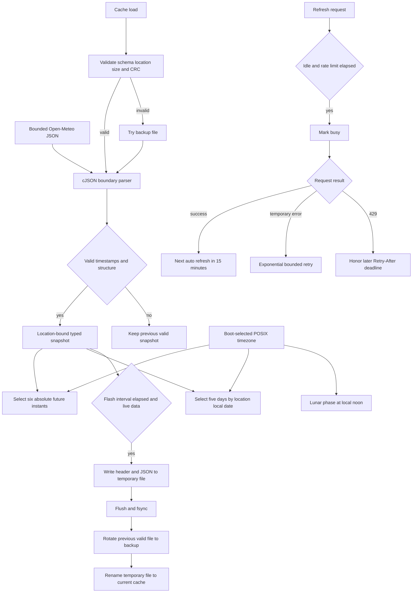

# Weather data component

```mermaid
flowchart TD
    Body[Bounded Open-Meteo JSON] --> Parse[cJSON boundary parser]
    Parse --> Valid{Valid timestamps and structure}
    Valid -->|yes| Snapshot[Location-bound typed snapshot]
    Valid -->|no| Keep[Keep previous valid snapshot]
    Snapshot --> Hours[Select six absolute future instants]
    Snapshot --> Days[Select five days by location local date]
    TZ[Boot-selected POSIX timezone] --> Hours
    TZ --> Days
    TZ --> Moon[Lunar phase at local noon]
    Snapshot --> Gate{Flash interval elapsed and live data}
    Gate -->|yes| Temp[Write header and JSON to temporary file]
    Temp --> Sync[Flush and fsync]
    Sync --> Backup[Rotate previous valid file to backup]
    Backup --> Rename[Rename temporary file to current cache]
    Boot[Cache load] --> Check[Validate schema location size and CRC]
    Check -->|valid| Parse
    Check -->|invalid| Previous[Try backup file]
    Previous --> Parse
    Request[Refresh request] --> Allowed{Idle and rate limit elapsed}
    Allowed -->|yes| Busy[Mark busy]
    Busy --> Result{Request result}
    Result -->|success| Interval[Next auto refresh in 15 minutes]
    Result -->|temporary error| Backoff[Exponential bounded retry]
    Result -->|429| Retry[Honor later Retry-After deadline]
```
