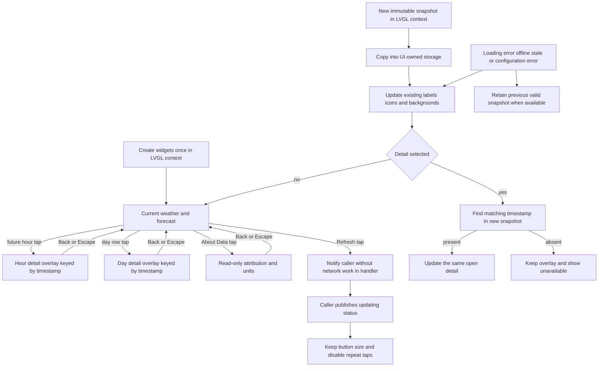

# Shared LVGL screen

```mermaid
flowchart TD
    Init[Create widgets once in LVGL context] --> Main[Current weather and forecast]
    Main -->|future hour tap| Hour[Hour detail overlay keyed by timestamp]
    Main -->|day row tap| Day[Day detail overlay keyed by timestamp]
    Main -->|About Data tap| About[Read-only attribution and units]
    Hour -->|Back or Escape| Main
    Day -->|Back or Escape| Main
    About -->|Back or Escape| Main
    Main -->|Refresh tap| Callback[Notify caller without network work in handler]
    Callback --> Busy[Caller publishes updating status]
    Busy --> Disabled[Keep button size and disable repeat taps]
    Snapshot[New immutable snapshot in LVGL context] --> Copy[Copy into UI-owned storage]
    Copy --> Update[Update existing labels icons and backgrounds]
    Update --> Selection{Detail selected}
    Selection -->|yes| Lookup[Find matching timestamp in new snapshot]
    Lookup -->|present| Detail[Update the same open detail]
    Lookup -->|absent| Missing[Keep overlay and show unavailable]
    Selection -->|no| Main
    State[Loading error offline stale or configuration error] --> Update
    State --> Cache[Retain previous valid snapshot when available]
```
